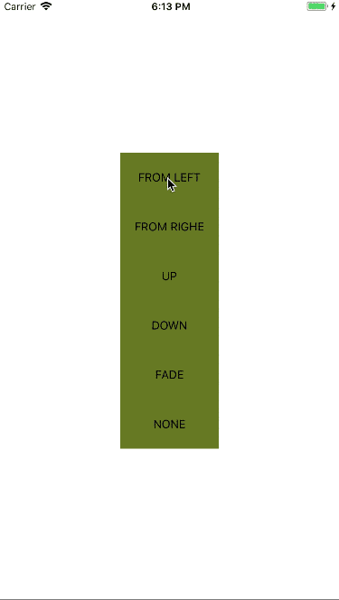

# react-native-modalui &middot; [](https://badge.fury.io/js/react-native-modalui) [](http://makeapullrequest.com)
react-native-modalui provide you react-native modal with more animation type.

* Features(#features)
* Preview(#preview)
* Usage(#usage)
* API Reference(#api-reference)
* Example(#example)

## Features
react-native build-in modal provide only few animation type,and once you can only use one modal,but in some condition, we need more then one modal.the react-native-modalui can support this condition,and provide you more animation type.
## Preview

## Usage
```
import React, { Component } from 'react';
import {
  StyleSheet,
  Text,
  View,
  TouchableOpacity
} from 'react-native';
import Modal from 'react-native-modalui';

export default class App extends Component<{}> {
  constructor(...props){
    super(...props);
    this.state = {
      isVisible:false,
      animationType:'none'
    }
  }
  _showModal=(animationType)=>{
    this.setState({isVisible:true,animationType})
  }
  _hideModal=()=>{
    this.setState({isVisible:false})
  }
  render() {
    return (
      <View style={styles.container}>
        <TouchableOpacity 
          style = {styles.button}
          onPress = {()=>this._showModal('slideLeft')}>
          <Text>FROM LEFT</Text>
        </TouchableOpacity>
        <Modal 
          style={styles.container}
          animationType = {this.state.animationType}
          onBackdropPress = {this._hideModal}
          isVisible = {this.state.isVisible}>
        <TouchableOpacity 
          style = {styles.button}
          onPress = {this._hideModal}>
          <Text>HIDE</Text>
        </TouchableOpacity>
        </Modal>
      </View>
    );
  }
}

const styles = StyleSheet.create({
  container: {
    flex: 1,
    justifyContent: 'center',
    alignItems: 'center',
  },
  button:{
    height:60,
    width:120,
    justifyContent: 'center',
    alignItems: 'center',
    backgroundColor:'#667823'
  },
  text:{
    color:'#333333'
  }
});

```
## API Reference
### props
| Name | Type| Default | Description |
| --- | --- | --- | --- |
| animationType | string | 'slideUp' |  animation type |
| easing | object | Easing.ease | animation timing function |
| duration | number | 200 |  animation duration |
| onBackButtonPress | func | () => null | Called when the Android back button is pressed |
| onBackdropPress | func | () => null | Called when the backdrop is pressed |
| isVisible | bool | **REQUIRED** | Show the modal? |
| onModalShow | func | () => null | Called when the modal is completely visible |
| onModalHide | func | () => null | Called when the modal is completely hidden |
| style | any | null | Style applied to the modal |
## Example
```
cd example && npm install
```
now,you can run the example in the example directory.